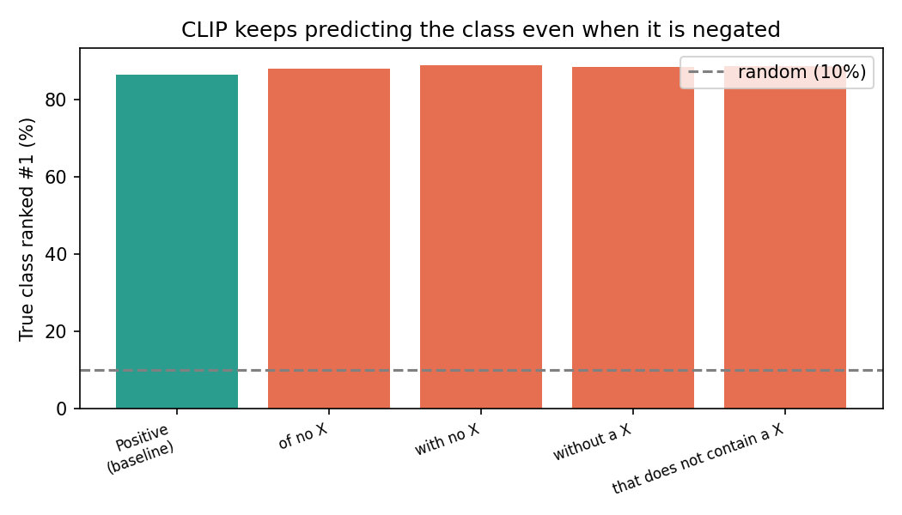
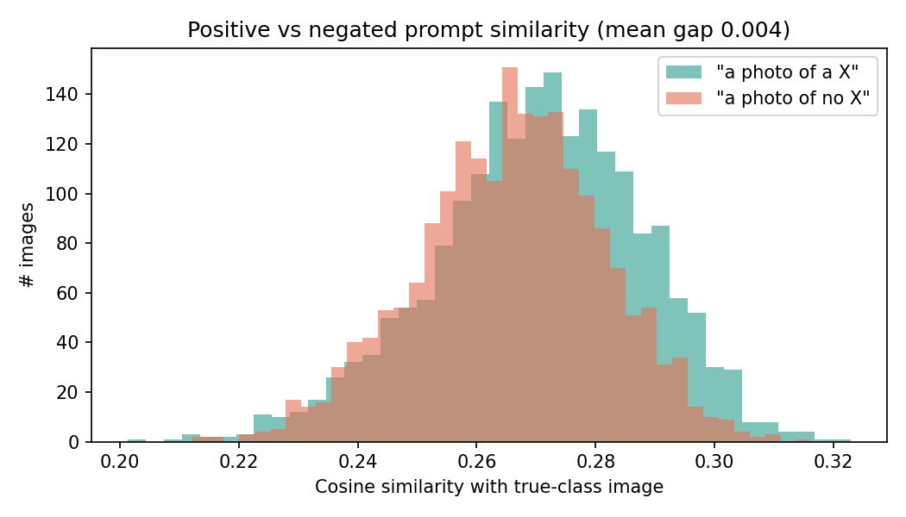
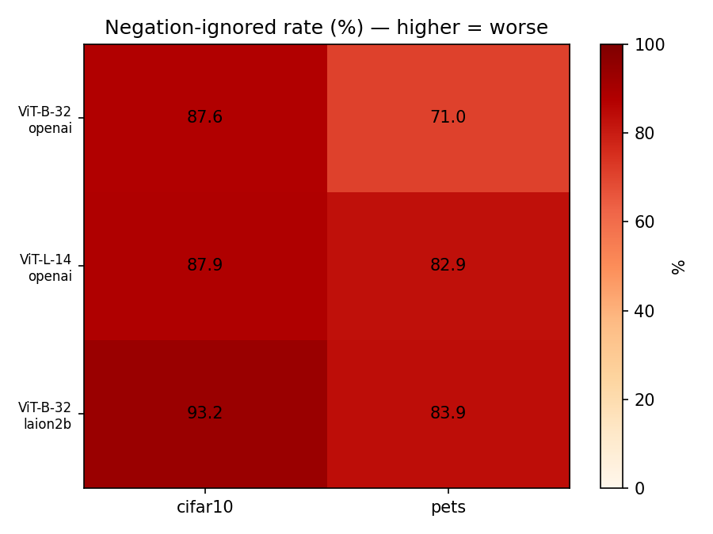
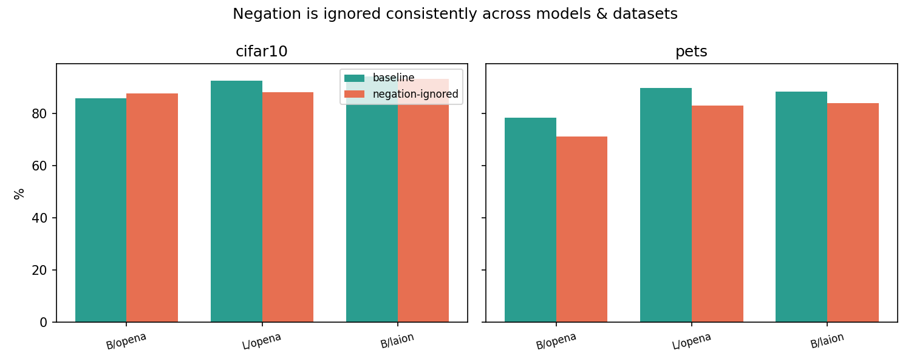

# Does CLIP Understand "No"? — Reproducing CLIP's Negation Blindness

CLIP 같은 vision-language model이 **부정(negation)**을 제대로 처리하지 못하는 현상을
직접 재현하고, 여러 모델·데이터셋에서 일관되게 나타남을 정량적으로 확인한 미니 연구 프로젝트입니다.

> **동기**: 고려대 Vision & AI Lab의 ICCV 2025 논문
> *"Know 'No' Better: A Data-Driven Approach for Enhancing Negation Awareness in CLIP"* (Park et al.)
> 를 읽고, CLIP의 negation 약점이 실제로 얼마나 심한지, 그리고 모델/데이터를 바꿔도
> 사라지지 않는지 직접 손으로 확인해보고 싶었습니다.

---

## TL;DR

- CLIP은 `"a photo of a cat"`과 `"a photo of no cat"`을 거의 구분하지 못합니다.
- 정답 클래스를 **부정**했는데도 여전히 그 클래스를 1등으로 뽑는 비율(**negation-ignored rate**)이
  71~93%에 달했습니다.
- 모델을 키우거나(ViT-B/32 → ViT-L/14) 더 큰 데이터로 학습해도(OpenAI → LAION-2B)
  개선되지 않았습니다 → **문제의 원인이 모델 용량이 아니라 학습 데이터에 있다**는
  논문의 가설을 뒷받침합니다.

---

## 1. 핵심 실험: 단일 모델 재현 (CIFAR-10)

`clip_negation.ipynb` — CLIP ViT-B/32(OpenAI)로 CIFAR-10에서 세 가지를 측정합니다.

1. **표준 zero-shot baseline**: `"a photo of a {class}"`로 일반 분류 정확도
2. **Negation-ignored rate**: 분류 프롬프트를 `"a photo of no {class}"`로 바꿔도
   정답 클래스가 1등으로 뽑히는 비율 (높을수록 = `no`를 무시했다는 증거)
3. **유사도 분포**: 같은 이미지에서 긍정/부정 프롬프트의 코사인 유사도 비교

### 결과

| 지표 | 값 |
|------|-----|
| 긍정 프롬프트 정확도 | **86.4%** |
| 부정 프롬프트 평균 무시율 | **88.5%** |
| 긍정-부정 유사도 평균 차이 | **0.0045** |

부정 무시율(88.5%)이 긍정 정확도(86.4%)보다도 **높습니다**. 즉 CLIP은 `no cat`을
사실상 `cat`으로 읽었습니다. 유사도 차이도 0에 수렴 → 부정어가 임베딩에 거의 영향을 주지 못합니다.




---

## 2. 일반성 검증: 모델 × 데이터셋 그리드

`clip_negation_level1.ipynb` — "특정 설정의 우연"이 아님을 보이기 위해
**모델 3종 × 데이터셋 2종**에서 negation-ignored rate를 측정했습니다.

- 모델: ViT-B/32 (OpenAI), ViT-L/14 (OpenAI), ViT-B/32 (LAION-2B)
- 데이터: CIFAR-10, Oxford-IIIT Pets

### Negation-ignored rate (%) — 높을수록 나쁨

| 모델 \ 데이터 | CIFAR-10 | Oxford Pets |
|---|---|---|
| ViT-B/32 (OpenAI) | 87.6 | 71.0 |
| ViT-L/14 (OpenAI) | 87.9 | 82.9 |
| ViT-B/32 (LAION-2B) | 93.2 | 83.9 |

### Baseline zero-shot accuracy (%) — 참고용

| 모델 \ 데이터 | CIFAR-10 | Oxford Pets |
|---|---|---|
| ViT-B/32 (OpenAI) | 85.7 | 78.2 |
| ViT-L/14 (OpenAI) | 92.3 | 89.7 |
| ViT-B/32 (LAION-2B) | 94.1 | 88.3 |




### 통찰

- **6개 조합 전부**에서 무시율이 무작위 기댓값(CIFAR 10%, Pets 약 2.7%)을 압도 →
  negation 무시는 CLIP 계열의 **공통 현상**입니다.
- 모델을 키워도(B/32 → L/14) 개선되지 않았습니다 (Pets는 오히려 71.0 → 82.9로 악화).
- 더 큰 데이터로 학습한 LAION-2B 모델이 오히려 무시율이 더 높았습니다 (CIFAR 93.2).
- 즉 문제는 **모델 용량이나 데이터 양이 아니라, 학습 데이터에 부정 표현이 부족하다는 점**에
  있다는 논문의 주장과 일치합니다.

---

## 실행 방법

Google Colab **GPU 런타임**에서 노트북을 열고 위에서부터 실행하면 됩니다.
필요한 패키지는 첫 셀에서 설치합니다.

```bash
pip install open_clip_torch
```

처음 실행 시 데이터셋과 CLIP 가중치를 자동으로 내려받습니다.

---

## 다음 단계 (계획)

- **순수 무시율 지표**: baseline에서 맞춘 이미지만 대상으로 negation 인식 능력을 더 공정하게 측정
- **복합 부정**: `"A and no B"` 형태(멀티객체, COCO 기반)로 난이도 확장
- **Training-free 완화**: fine-tuning 없이 점수 보정만으로 어디까지 개선되는지 탐색
  (논문은 데이터 생성 + fine-tuning으로 해결)

---

## 참고

- Park et al. *Know "No" Better: A Data-Driven Approach for Enhancing Negation
  Awareness in CLIP.* ICCV 2025. (Vision & AI Lab, Korea University)
- Radford et al. *Learning Transferable Visual Models From Natural Language Supervision* (CLIP). 2021.
